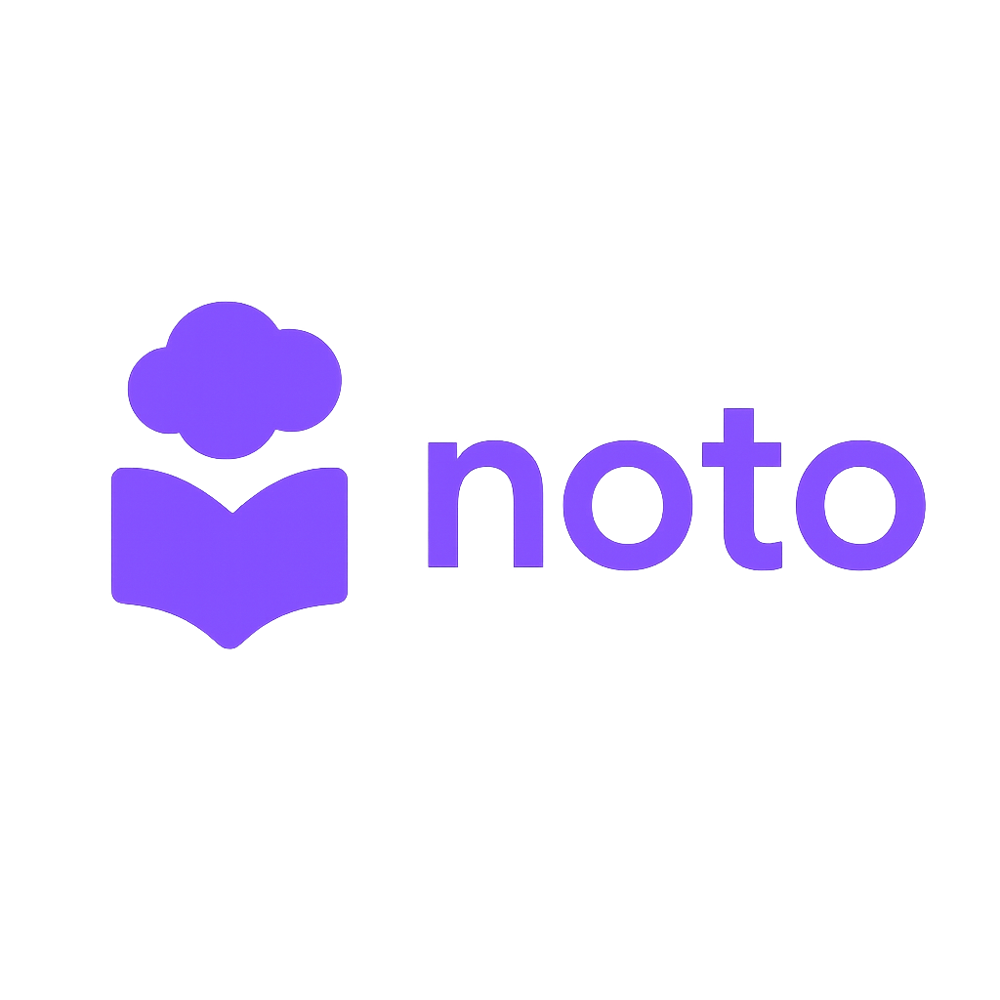

<p align="center">
    
</p>

**Noto** is an advanced interactive learning platform designed to streamline the study process. By leveraging the power of **Google Gemini AI**, **Noto** transforms uploaded documents and notes into dynamic learning assets, like flashcards and interactive quizzes.

> This project was developed as a **Computer Science Final Project for the 2026 Bagrut**.

---

## 🚀 The "Why"
Traditional studying is often passive and time-consuming. **Noto** was built to make learning **active, effective, and fast** by:
* **Active Recall:** Generating instant flashcards to strengthen long-term memory.
* **Gamified Assessment:** Creating quizzes to test knowledge retention and identify weak spots.

---

## ✨ Key Features
* **Automated Flashcards:** Convert your learning materials into study decks with a single click.
* **Interactive Quizzes:** Generate custom quizzes based on your specific files to test your understanding.
* **Quiz Sharing:** Collaborate with classmates by sharing your generated quizzes via unique, shareable links.
* **Modern UI/UX:** A sleek, responsive interface built with accessibility and focus in mind.

---

## 🛠 Tech Stack

### Frontend
* **Next.js:** React framework for high-performance routing and rendering.
* **Shadcn/UI & Tailwind CSS:** For a modern, professional, and responsive design system.

### Backend
* **ASP.NET Core:** Robust and scalable backend architecture.
* **Entity Framework Core:** For efficient database management and ORM.
* **PostgreSQL:** Reliable relational database for user accounts and study data.

### AI Engine
* **Google Gemini API:** Providing the intelligence behind content analysis, summarization, and question generation.

---

## ⚙️ Setup & Configuration

### Backend Configuration
1. Navigate to the `/backend` folder.
2. Ensure your `appsettings.json` is configured as follows:
```json
{
  "Logging": {
    "LogLevel": {
      "Default": "Information",
      "Microsoft.AspNetCore": "Warning"
    }
  },
  "Jwt": {
    "Key": "YOUR_SECURE_JWT_KEY",
    "Issuer": "noto",
    "Audience": "noto_users"
  },
  "ConnectionStrings": {
    "DefaultConnection": "Host=...;Port=...;Database=...;Username=...;Password=..."
  }
}
```
3. Set the `DATABASE_URL` environment variable for your PostgreSQL connection string.
4. Run `dotnet ef database update` followed by `dotnet run`.

### Frontend Configuration
1. Navigate to the `/frontend` folder.
2. Create a `.env.local` file with the following variables:
```
NEXT_PUBLIC_API_URL=your_backend_api_url
NEXT_PUBLIC_GEMINI_API_KEY=your_google_gemini_api_key
```
3. Run `npm install` and then `npm run dev`.

## 🛡️ Authentication
The platform uses JWT (JSON Web Token) for secure user sessions. The backend validates the `Issuer` and `Audience` to ensure that only authorized users can access and share study materials.

## 📝 License
Distributed under the MIT License.